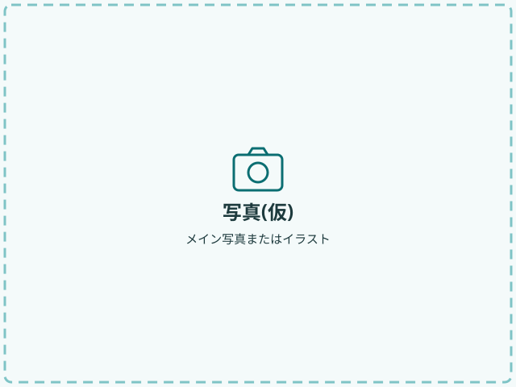

# 社会保険労務士事務所ホームページ(仮版)

ビルド不要の静的サイトです。HTML / CSS / 少量の JavaScript だけでできています。
現在は **すべての事務所情報が仮の値** で、**まだ公開していません**。

## ファイル構成

```
site/
  index.html        ページ本体(文章はここを編集)
  css/style.css     デザイン(色・文字は冒頭の変数で一括管理)
  js/main.js        メニュー開閉・共通情報の反映・フォーム(準備中)表示
  images/           ロゴ・写真の置き場(仮画像が入っています)
    hero-placeholder.svg     メイン写真(仮)
    profile-placeholder.svg  代表の写真(仮)
    ogp-placeholder.png      SNSシェア用画像(仮・1200×630)
  README.md         このファイル
```

## 手元で表示を確認する

ターミナルで `site` フォルダに移動して、次を実行します。

```
python3 -m http.server 8000
```

ブラウザで http://localhost:8000/ を開きます。止めるときはターミナルで `Ctrl + C` を押します。
(`index.html` をダブルクリックして開いても、だいたいの表示は確認できます。)

スマホ幅の確認は、ブラウザの開発者ツール(Chrome なら `F12` → 端末のアイコン)で幅を 400px 程度にして見ます。

---

## よく行う編集

編集には、テキストエディタ(VS Code、メモ帳など)を使います。Word は使わないでください。
保存するときの文字コードは **UTF-8** にします。
HTML の中の `<!-- 〜 -->` はメモ書き(コメント)で、画面には表示されません。
「【ここを編集】」「【ここを後で差し替える】」と書かれた場所が編集ポイントです。

### 1. 事務所名・住所・電話・営業時間を変える

`index.html` の上の方(`<head>` の中)にある **「事務所の共通情報」** を書き換えます。
ここを直すと、ヘッダー・事務所概要の表・フッターにまとめて反映されます。

```json
{
  "name": "[事務所名] 社会保険労務士事務所",
  "address": "大阪府[市区町村・番地]",
  "tel": "[00-0000-0000]",
  "hours": "[平日 9:00〜18:00(土日祝休み)]",
  "association": "大阪府社会保険労務士会"
}
```

- `"` で囲まれた中身だけを書き換えます。`"` や `,` を消すと表示されなくなります。
- 電話番号は、スマホでタップすると発信できるリンクに自動でなります。
- **ページのタイトル(`<title>`)・説明文(`description`)・`og:〜` の行にも事務所名が入っています。** 検索エンジンやSNSが読む部分なので、共通情報とは別に、同じ `<head>` の中で書き換えてください。

### 2. 文章を変える

`index.html` で変えたい文章を探し、タグ(`<p>` や `<h3>` など)の **間の文字だけ** を書き換えます。

```html
<p>[説明文・仮]</p>   →   <p>就業規則や労務の悩みを、〜〜</p>
```

### 3. 料金を変える

`index.html` の「料金の目安」にある `[○,○○○]` などを書き換えます。

```html
<p class="price"><span class="price-amount">[○,○○○]</span>円〜</p>
<p class="price-note">[税別/税込]・[1回あたり等の注記]</p>
```

- 「おすすめ」の枠は、`class="card price-card price-card-featured"` が付いたカードです。別のカードをおすすめにするときは、`price-card-featured` と `<p class="price-badge">おすすめ</p>` をそのカードに移します。
- **金額を本物にしたら、`※ 現在掲載している金額はすべて仮です。` の1行(`class="temp-notice"`)を行ごと削除してください。**

### 4. お知らせを追加する

「お知らせ・コラム」の一覧で、次の1行をコピーして、一覧の **一番上** に貼り付けます。

```html
<li class="news-item"><time class="news-date" datetime="2026-01-01">[2026.01.01]</time><span class="news-title">[お知らせタイトル・仮1]</span></li>
```

日付は `datetime="2026-04-01"`(機械向け)と `2026.04.01`(表示用)の **2か所** を書き換えます。
古いお知らせは行ごと削除してかまいません。

### 5. よくあるご質問(FAQ)を追加する

`<details class="faq-item">` から `</details>` までをコピーして、質問と回答を書き換えます。

### 6. カード(理由・サービス・料金)を増やす

各セクションのコメントに書いてある範囲(例:`<article class="card service-card">` 〜 `</article>`)を1つコピーして貼り付けます。
パソコン表示では3つずつ横に並び、4つ目からは次の段に回ります。

### 7. 写真を差し替える

1. 写真を `images/` フォルダに入れます(例:`hero.jpg`、`profile.jpg`)。
2. `index.html` の該当する `` の `src` を書き換えます。
3. `alt`(写真の説明文)も、内容に合わせて書き換えます。

```html

↓

```

- 写真の目安:メイン写真は横長(4:3程度、幅1280px程度)、代表写真は縦長(4:5程度、幅800px程度)。
- ファイルサイズは1枚300KB程度までに抑えると表示が速くなります。
- `width` と `height` は写真の縦横比に合わせて書き換えると、読み込み中のレイアウトのずれが減ります。

### 8. ロゴを入れる

`index.html` のヘッダー部分にあるコメントの指示に従います。

1. `images/logo.svg`(または `logo.png`、背景透明)を置きます。
2. `<span class="logo-text" data-office="name"></span>` の行を削除します。
3. その上にある `` の行のコメントを外します(行の最初の `<!--` と最後の `-->` を消す)。

ロゴは高さ48pxまでに収まるよう自動で縮小されます。

### 9. お問合せフォームを編集する

フォームは「お問合せ」と「初回無料相談」の2種類を、上の切り替えボタンで切り替えます。

- **説明文**:`<p class="contact-lead" data-mode-only="inquiry">`(お問合せ)と `data-mode-only="consult"`(初回無料相談)の文字を書き換えます。
- **共通の項目**(会社名〜お問い合わせ内容):フォーム内の「▼ 共通の項目」の部分です。
- **お問合せだけの項目**(回答方法):「▼ 「お問合せ」のときだけ表示する項目」の部分です。
- **初回無料相談だけの項目**(予約希望日時・ご面会方法・訪問先住所):「▼ 「初回無料相談」のときだけ表示する項目」の部分です。
- 隠れている側の項目は送信されず、必須チェックもされません。送信データの `form_type` に「お問合せ」か「初回無料相談」が入ります。

#### 予約カレンダーで選べる日・時間帯を変える

`index.html` の「事務所の共通情報」の中の `"reservation"` を書き換えます。

```json
"reservation": {
  "firstHour": 9,
  "lastHour": 17,
  "closedWeekdays": [0, 6],
  "closedDates": ["2026-12-29", "2026-12-30", "2026-12-31", "2027-01-01", "2027-01-02", "2027-01-03"],
  "daysFromToday": 1,
  "daysAhead": 60
}
```

| 項目 | 意味 | 例 |
|---|---|---|
| `firstHour` / `lastHour` | 選べる時間帯の最初と最後の開始時刻(1時間単位) | 9 と 17 → 9:00〜10:00 から 17:00〜18:00 まで |
| `closedWeekdays` | 選べない曜日(0=日 1=月 2=火 3=水 4=木 5=金 6=土) | `[0, 6]` → 土日は選べない |
| `closedDates` | 選べない日(祝日・年末年始・休業日) | `"2027-01-11"` のように追加 |
| `daysFromToday` | 何日後から選べるか | 1 → 明日から、2 → 明後日から |
| `daysAhead` | そこから何日先まで選べるか | 60 → 約2か月先まで |

祝日は自動では判定しません。**`closedDates` に祝日を毎年追加してください。**

### 10. 色を変える

`css/style.css` の一番上にある `:root { ... }` の色コード(`#0b6e72` など)を書き換えます。
ページ全体の色がまとめて変わります。

| 変数名 | 現在の色 | 使われている場所 |
|---|---|---|
| `--color-primary` | `#0b6e72` | ボタン、リンク、見出しのアクセント |
| `--color-primary-dark` | `#08464a` | 見出し、お問合せ背景 |
| `--color-primary-light` | `#7fc4c6` | 番号の下線、点線枠などの装飾 |
| `--color-bg-tint` | `#eaf6f6` | ヒーロー背景 |
| `--color-bg-soft` | `#f4fafa` | 交互セクションの背景 |
| `--color-border` | `#d6e8e8` | 罫線、カードの枠 |
| `--color-text` | `#1d3a3d` | 本文 |
| `--color-white` | `#ffffff` | 背景、ボタン文字 |
| `--color-gray` | `#7a8789` | お問合せフォームの選択ボタン・時間帯の未選択の枠 |
| `--color-attention` | `#f2b950` | お問合せフォームの入力漏れの目印 |
| `--color-sunday` / `--color-saturday` | `#b3261e` / `#1f5fa8` | 予約カレンダーの「日」「土」 |

色を変えたら、文字と背景のコントラスト比が 4.5:1 以上あるか確認してください
(「コントラスト チェッカー」で検索すると、無料の確認ツールがあります)。
`--color-primary-light` は薄い色なので、文字色には使わず装飾だけに使っています。

---

## 公開前のチェック:仮の値の取りこぼしを探す

仮の値はすべて `[ ]` で囲んであります。エディタの検索機能(`Ctrl + F` / Mac は `⌘ + F`)で
**`[`** を検索し、残っていないか確認してください。

- `index.html`:文章・料金・氏名・お知らせ・FAQ・OGP・canonical など
- `js/main.js` や `css/style.css` にも `[` は出てきますが、これはプログラムの記号なので変更不要です。

ターミナルを使う場合は、`site` フォルダで次のコマンドでも探せます。

```
grep -n "\[" index.html
```

あわせて次も確認します。

- [ ] `images/` の仮画像(`*-placeholder.*`)を使っている箇所が残っていないか(`placeholder` で検索)
- [ ] 料金の「金額はすべて仮です」の1行を削除したか
- [ ] 「お問合せ／初回無料相談のご予約」ボタンや「初回のみ相談料無料」の説明が、実際の初回相談の条件と合っているか
- [ ] 予約カレンダーの設定(`reservation`)の祝日・休業日(`closedDates`)を、その年の分に更新したか
- [ ] 誇大・断定的な表現(「必ず」「日本一」など)や、根拠のない実績・数字が入っていないか
- [ ] 所属会(大阪府社会保険労務士会)の広告に関するルールに沿っているか(ご自身で確認)
- [ ] お問合せフォームで個人情報を受け取る前に、プライバシーポリシーのページを用意したか

---

## 後日の紐付け手順(公開するとき)

公開の準備ができたら、次の順に進めます。

1. **仮情報を差し替える。** 仮の値(`[ ]`)をすべて本物にします。写真・ロゴを `images/` に入れます(上の「公開前のチェック」を参照)。
2. **ホスティング先を決める。** 静的サイト向けのサービスやレンタルサーバーなどから選び、`site/` の **中身**(`index.html`、`css/`、`js/`、`images/`)をアップロードします。`README.md` はアップロード不要です。
3. **独自ドメインを紐付ける。** 独自ドメインを取得し、ホスティング先の案内に従って DNS を設定します。HTTPS(SSL)を有効にし、`https://` で表示されることを確認します。
4. **お問合せフォームの送信先を設定する。** フォーム送信サービス、またはメール送信の仕組みを用意します。
   - `index.html` の `<form class="contact-form" action="#" ...>` の `action="#"` を、送信先のURLに差し替えます(サービスによっては `name` 属性などの指定もあるので、その案内に合わせます)。
   - `data-form-status="preparing"` を削除し、`js/main.js` の「7. お問合せフォーム(準備中)」のブロック(「準備中ここまで」まで)を削除します。
   - プライバシーポリシーへのリンク(フォーム内のコメント参照)を入れます。
   - **実際にテスト送信して、メールが届くことを確認します。**
5. **検索・SNS向けの設定を本番のURLに合わせる。** `index.html` の `<head>` で次を更新します。
   - `<title>` とメタディスクリプション(`description`)
   - `og:url` を本番のURLに
   - `og:image` を本番のOGP画像の絶対URL(例:`https://(ドメイン)/images/ogp.png`)に
   - `canonical` の行のコメントを外し、本番のURLに
6. **名刺・パンフレットを作る。** 確定したURLで、名刺・パンフレットに載せるURLとQRコードを作ります(QRコードを読み取って正しく開くか確認します)。
7. **必要に応じて追加する。** アクセス解析の導入や、Googleビジネスプロフィールの登録を行います。

### 後から追加できるページ

- プライバシーポリシー(`privacy.html`)、特定商取引法に基づく表記(`tokushoho.html`)など
  - `index.html` と同じフォルダに作り、フッターの該当行のコメントを外すとリンクが有効になります。
  - 新しいページは `index.html` をコピーして、`<main>` の中身を書き換えると作りやすいです。
